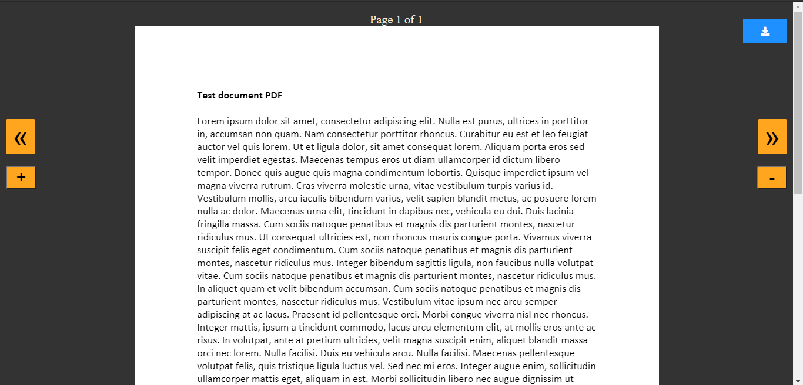

# CS50X-FP

<!--NAME OF THE PROJECT-->
## STUDINGER

<!--MOTIVATION-->
### MOTIVATION
This Project is meant to help students and teachers as the students and teachers have suffered a lot due of this pandemic.This application will allow teachers to share notes and communiate with the students.

<!--logo of our web application -->

---
<!--features -->
### FEATURES
---

* __Allows students and techers to communicate through chat. Using socketIO, a Real Time Communication is established and the messages are also logged into a sqlite database for providing a history of the chats.__

---
* __It has it's own pdf viewer which is also compatible with portable devices and is made with pdf.js and you can also download the documents from there.__

---
* __You can create and join classes,the backend generates a unique joining code for each class created and stores the data associated with it in the sqlite database__

---
* __The teacher of the class can upload notes with a comment which can be accessed by the students. The files are stored as a BLOBs in the Sqlite database__

___

### HOW TO USE ?

* Step1: Sign up 

* Step2: Login 

* Step3: Create or Join class 

* Step4: Get notes and start discussing with your teachers or classmates.  

---

### HOW TO ACCESS THE PROJECT ?
----

<!--github Link of the project-->
link - https://github.com/saksham3939/CS50X-FP

### CREDITS
---
<!--Name of the contributors-->
|Name       |Github Username    |
|---------- |------         |
|Anuj Gautam|Anuj17185      |
|Priyanshu  |PRIYANSHU160904|
|Saksham    |saksham3939    |
___

### ADDITIONAL TOOLS USED 

* Git and Github for source code
* VS Code(Text editor)

